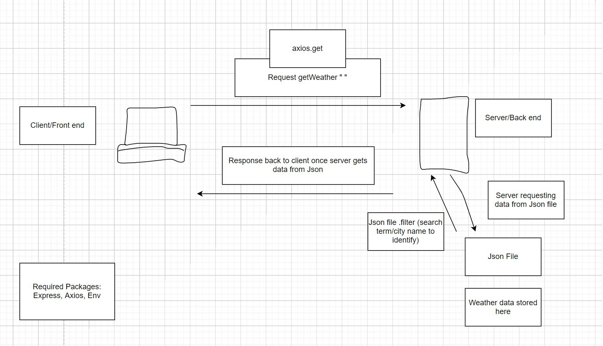
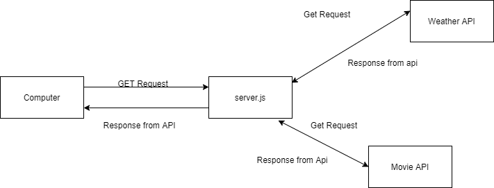
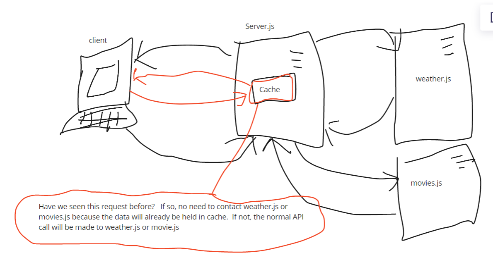

# city-explorer-api

## Author: Quentin P Young III

## Versions

### 3.0 - 11AUG2021

Restaurant data is now retieved from Yelp API

---
### Previous Versions

2.1 - 07AUG2021

Weather and Movie gets are now modularized.

2.0.0 06AUG2021

Server is now deployed to heroku. Weather and movie data are gathered from live API calls via ReSTful API's.

1.0.0 01AUG2021

V1.0 implements data from a JSON file. As such, search is limited for the weather feature. Future iterations will enable a much wider availability of search results as it pertains to weather data. Current searchable cities include Seattle, Paris, and Amman.

## Technologies

[Express](https://expressjs.com/)

[Axios](https://axios-http.com/docs/intro)

[Trello](https://trello.com/)

[node.js](https://nodejs.org/en/)

[Heroku](#)

## Using .env

A sample .env has been added to the repo. To use, add your own weather API and movie API keys directly after the "=". Those keys can then be accessed within your local files and used to make get necessary data. Movie API makes calls to *themoviedb.org*, while the weather API makes calls to *weatherbit.io*. Sign up may be required.

## Design

With Movie and Weather API

Data is now cached

### Feature 1: Set up

Estimate of time needed to complete: 15min

Start time: 1:50pm 31JUL2021

Finish time: 2:03pm 31JUL2021

Actual time needed to complete: 13min

### Feature 2: See Weather Data After Search

Estimate of time needed to complete: 120min

Start time: 2:10pm 31JUL2021

Finish time: 7:00pm 31JUL2021

Actual time needed to complete: 300min

### Feature 3: Handle Errors from weather API

Estimate of time needed to complete: 60min

Start time: 11:00am 01AUG2021

Finish time: 12:30pm 01AUG2021

Actual time needed to complete: 90min

---

### Feature 4:Get movies about City Searched

Estimate of time needed to complete: 120min

Start time: 6:50pm 04AUG2021

Finish time: 8:30pm 04AUG2021

Actual time needed to complete: 100min

### Feature 5: Modularize Codebase

Estimate of time needed to complete: 60min

Start time: 1:15pm 07AUG2021

Finish time: 2:05 07AUG2021

Actual time needed to complete:50min

---
### Feature 6: Added Yelp endpoint

Estimate of time needed to complete: 60min

Start time: 6:40pm 11AUG2021

Finish time: 7:30pm 11AUG2021

Actual time needed to complete: 50min

---
